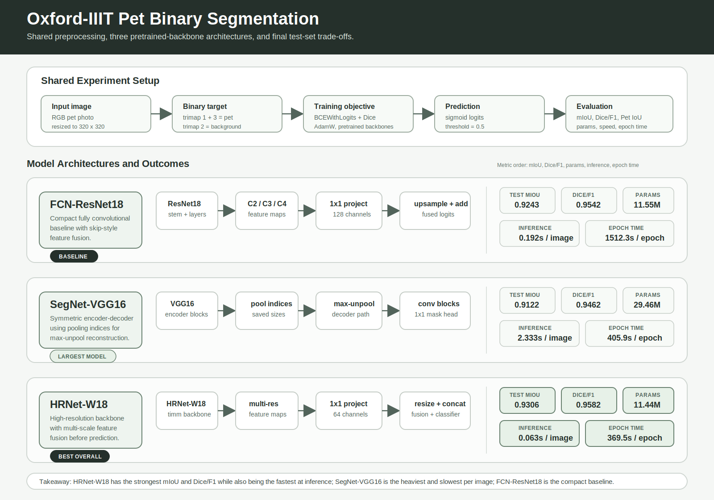
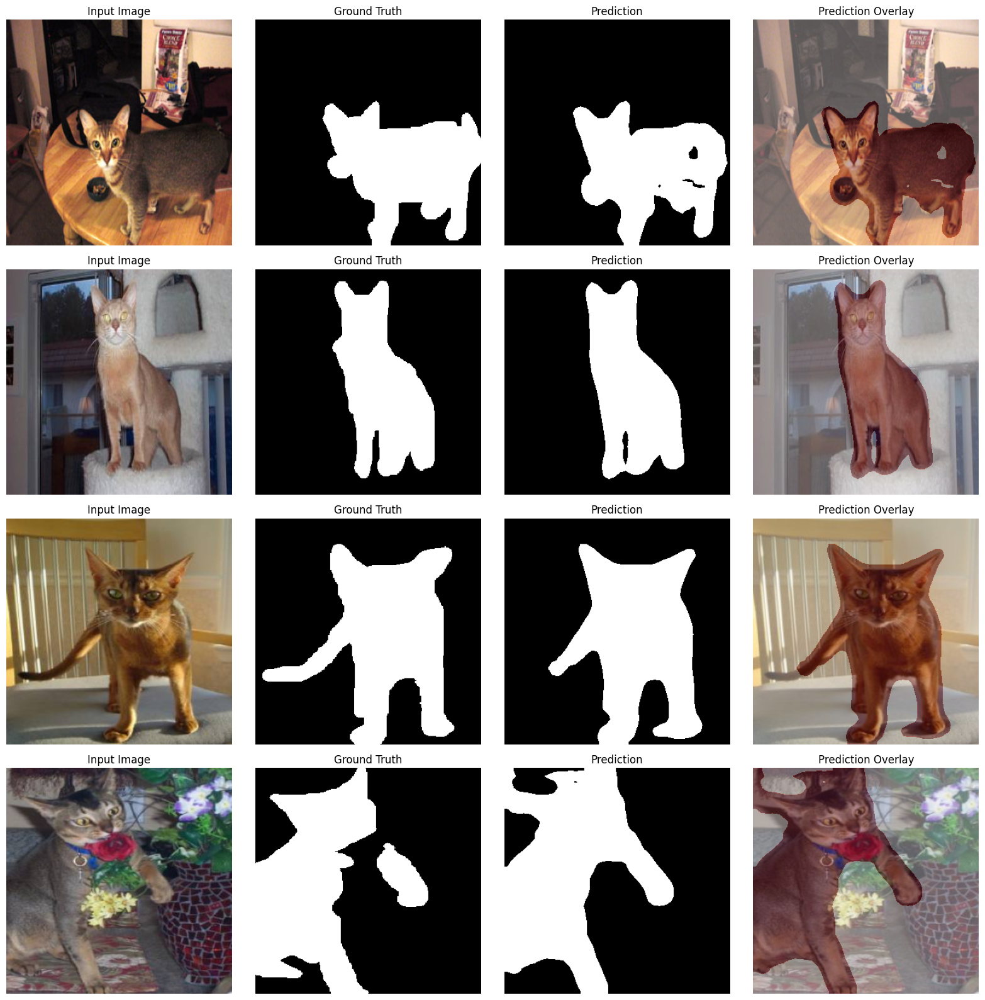
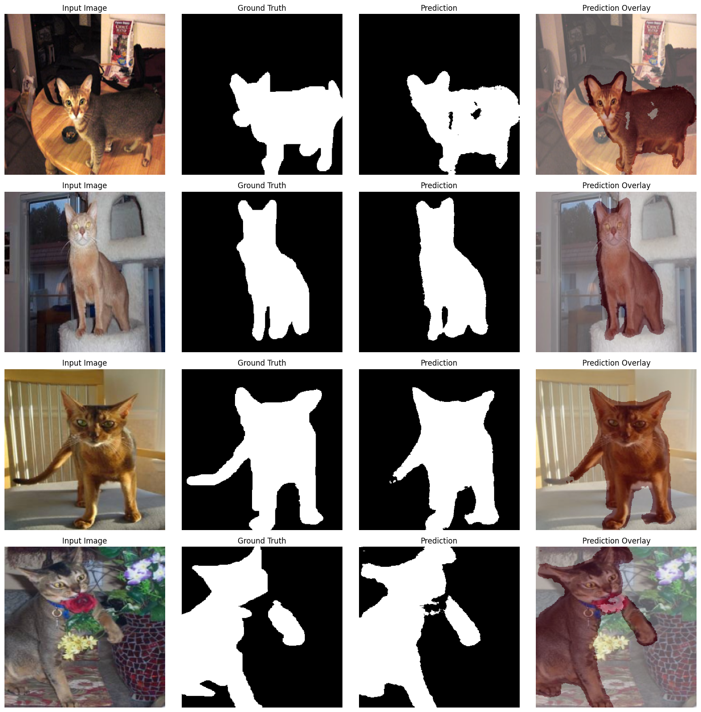
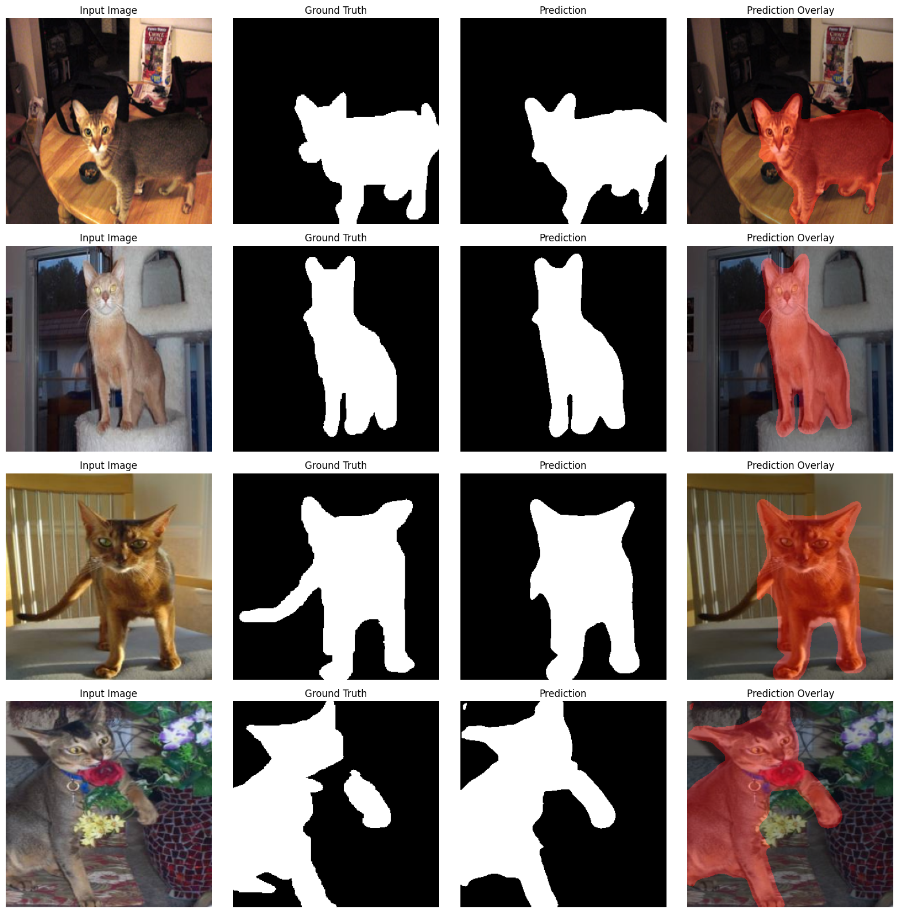

# Oxford Pet Binary Segmentation

This repository contains a fully functional PyTorch deep learning pipeline for binary semantic segmentation on the Oxford-IIIT Pet dataset. The task is to classify each pixel as either pet foreground or background using the dataset images and trimap annotations.

The pipeline implements, trains, evaluates, and compares three segmentation models:

- **FCN-ResNet18**
- **SegNet-VGG16**
- **HRNet-W18**

The final comparison is based on test-set segmentation metrics, model size, inference speed, and training efficiency.

## Tech Stack & Core Skills

This project demonstrates the following technical capabilities:
- PyTorch model implementation and custom training loops
- Semantic segmentation preprocessing, data augmentation, and evaluation
- Transfer learning with pretrained computer-vision backbones
- Custom PyTorch dataset and dataloader design
- Metric-driven model comparison (mIoU, Dice/F1)
- Experiment tracking and artifact management

## Project Highlights & Methodology

The pipeline follows an end-to-end workflow designed for consistent and rigorous evaluation:
1. **Data Preparation:** Resolves the dataset location and loads fixed train/validation/test splits to ensure consistent evaluation. Converts trimap annotations into binary foreground/background masks.
2. **Preprocessing:** Applies image resizing, normalization, and training-time augmentations.
3. **Training:** Trains the FCN-ResNet18, SegNet-VGG16, and HRNet-W18 models using PyTorch, saving the best checkpoints locally.
4. **Evaluation:** Evaluates models on the fixed test split using mIoU, pet IoU, Dice/F1, pixel accuracy, precision, and recall.
5. **Comparison:** Analyzes accuracy alongside parameter count, inference time per image, and epoch training time. Qualitative prediction grids and comparison plots are generated for visual inspection.

## Models

| Model | Backbone | Notes |
| --- | --- | --- |
| FCN-ResNet18 | ResNet18 | Lightweight fully convolutional baseline with skip-style feature fusion. |
| SegNet-VGG16 | VGG16 | Encoder-decoder segmentation model using max-unpooling indices. |
| HRNet-W18 | HRNet-W18 | High-resolution backbone with multi-scale feature fusion through `timm`. |

## Results

Final test metrics from the saved experiment artifacts:

| Model | Test mIoU | Pet IoU | Dice/F1 | Pixel Accuracy | Parameters | Inference / Image |
| --- | ---: | ---: | ---: | ---: | ---: | ---: |
| FCN-ResNet18 | 0.9243 | 0.9124 | 0.9542 | 0.9617 | 11.55M | 0.1919s |
| SegNet-VGG16 | 0.9122 | 0.8980 | 0.9462 | 0.9553 | 29.46M | 2.3331s |
| HRNet-W18 | 0.9306 | 0.9198 | 0.9582 | 0.9650 | 11.44M | 0.0633s |

**Key takeaway: HRNet-W18 achieved the strongest test mIoU and Dice/F1 score in this experiment while also producing the fastest measured inference time per image.**

## Visual Overview

### Architecture Comparison



### Qualitative Predictions

The following examples are real prediction grids exported from the experiment. Each grid shows input images, ground-truth binary masks, predicted masks, and prediction overlays.

**FCN-ResNet18**



**SegNet-VGG16**



**HRNet-W18**



## Repository Structure

```text
pet_segmentation_models.ipynb       Main notebook with preprocessing, models, training, evaluation, and comparison
preprocessing_artifacts/            Fixed train/validation/test split CSVs
results_artifacts/model_results.csv Saved final comparison metrics
data/README.md                      Dataset placement instructions
requirements.txt                    Python dependencies
```

## Requirements

If you wish to run this pipeline locally, the following setup is required:

- Download the Oxford-IIIT Pet dataset and place it under `data/oxford_pet/`.
- Install dependencies via `pip install -r requirements.txt`. For GPU training, ensure your PyTorch build matches your CUDA version.
- Open `pet_segmentation_models.ipynb` to execute the pipeline.
